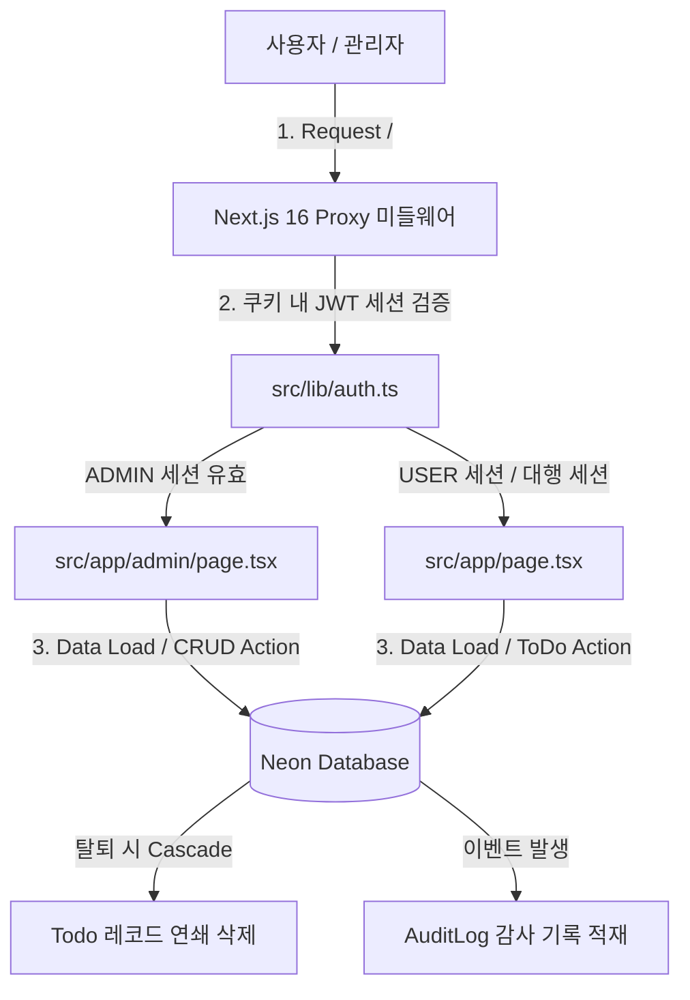

# To-Do 애플리케이션 어드민(ADMIN) Systems 기능 종합 보고서

본 보고서는 사용자의 보안 관리 효율성을 증대시키고 시스템을 안정적으로 모니터링하기 위해 최종 구현이 완료된 To-Do 애플리케이션의 **최고 관리자(ADMIN) 시스템 사양 및 핵심 기능**을 종합적으로 정리한 기술 문서입니다.

---

## 🛡️ 어드민 시스템 아키텍처 개요

시스템은 **역할 기반 접근 제어(RBAC, Role-Based Access Control)** 모델을 준수하며, 로그인 세션은 Next.js 16 비동기 쿠키 API와 `jose` 라이브러리를 이용한 Edge 런타임 친화적 **JWT 세션 쿠키** 시스템으로 구동됩니다. 

보안 계층으로 Next.js 16 파일 규격에 부합하는 **[proxy.ts](file:///c:/study/TODO/src/proxy.ts)** 미들웨어를 두어, 권한이 유효하지 않은 사용자가 어드민 영역에 직접 침투할 수 없도록 사전에 리다이렉트하는 완전 보안 제어를 적용했습니다.

---

## ⚙️ 구현 완료된 어드민 4대 핵심 기능

최고 관리자 화면은 일관되고 직관적인 UX 제공을 위해 **3개의 서브 탭(Tab) 구조**로 설계되었으며, 아래 기능들을 완전하게 실시간 지원합니다.

### 1. 회원 관리 및 권한 대행 (User Impersonation)
* **회원 수동 관리 (CRUD)**: 
  * 관리자가 대시보드 내에서 직접 일반 회원(`USER`) 및 어드민(`ADMIN`)을 추가할 수 있습니다.
  * 기존 회원의 아이디를 변경하거나 역할 변경, 또는 비밀번호를 임의로 초기화(해싱 재설정)할 수 있습니다.
  * 회원을 강제 삭제(탈퇴)할 수 있으며, 이 경우 데이터베이스 제약 조건(`ON DELETE CASCADE`)에 의해 **탈퇴 회원의 모든 To-Do 레코드가 연쇄 자동 삭제**되어 더미 데이터를 방지합니다.
* **사용자 권한 대행 로그인 (Impersonation)**:
  * 특정 사용자의 화면 버그나 데이터를 관리자가 대행 진단할 수 있도록, **해당 유저로 시뮬레이션 로그인**하는 우회 기능입니다.
  * 대행이 개시되면 쿠키에 본래의 어드민 ID(`impersonatorId`)를 암호화하여 저장한 상태로 유저 권한(`USER`) 세션을 새로 구워 홈(`/`)으로 이동합니다.
  * 대행 접속 중에는 메인 화면 최상단에 **경보 배너(Amber Banner)**와 **[어드민으로 복귀]** 버튼이 노출되며, 복귀 시 세션에서 대행 플래그를 탈거하고 즉시 원래 관리자 세션으로 돌려놓습니다.

### 2. 가입 통계 및 실시간 진행도 집계 (Analytics)
* **어드민 지표 산정**:
  * 데이터베이스의 쿼리를 수행하여 **총 가입 유저 수, 전체 To-Do 누적 개수, 완료 처리된 To-Do 개수**를 동적으로 연산합니다.
  * 전체 유저들의 작업 진행 상황을 보여주는 **전체 완료율(%) 지표**를 렌더링하고, 프로그레스 바 컴포넌트로 진행도를 시각화합니다.

### 3. 보안 감사 로그 적재 (Security Audit Trail)
* **감사 로깅 시스템 (`AuditLog`)**:
  * 관리 권한을 악용한 내부 조작 행위를 추적 및 모니터링하기 위해 별도의 감사 데이터베이스 테이블을 구축했습니다.
  * **회원 추가(`USER_CREATE`), 회원 편집(`USER_UPDATE`), 회원 삭제(`USER_DELETE`), 공지사항 등록/제거(`NOTICE_CREATE`/`NOTICE_DELETE`), 대행 시작/종료(`USER_IMPERSONATE_START`/`USER_IMPERSONATE_STOP`)** 작업이 일어날 때마다 동작한 어드민의 이메일 정보와 액션 종류, 변경점 상세 내역이 감사 테이블에 실시간 자동 적재됩니다.
  * 대시보드 내에서 최근 50개의 보안 로그를 역순으로 조회할 수 있습니다.

### 4. 실시간 공지사항 배포 및 전파 (System Notice Board)
* **시스템 공지사항 CRUD**:
  * 전체 사용자에게 공유해야 하는 마감 기한 경고나 중요 지침을 어드민이 대시보드에서 등록하거나 해제(삭제)할 수 있습니다.
* **사용자 전파 배너**:
  * 공지사항이 등록되면, 서비스를 사용 중인 모든 사용자의 메인 페이지 상단에 **블러 처리된 미니멀 그라데이션 공지 배너**가 즉시 연동되어 동적으로 노출됩니다.

---

## 💻 보안 및 기술 아키텍처 요약

1. **보안적 우회 차단**:
   * 대행 로그인 중에는 `role` 세션이 `USER`로 동작하므로, 브라우저 주소창에 `/admin`을 억지로 치고 진입하려 해도 `proxy.ts`에 의해 즉각 홈(`/`)으로 튕겨 나가게 되어 강력한 역할 격리를 보장합니다.
2. **트랜잭션 안전성**:
   * 유저 회원 정보 업데이트나 패스워드 재설정 시 DB 유니크 제약 조건을 사전 조회하여 이메일 충돌을 방지하고, bcrypt 복호 해시 연산만을 사용해 데이터베이스에 평문이 적재되는 일이 없도록 보안 처리했습니다.
3. **Vercel 빌드 보장성**:
   * `package.json` 스크립트를 재정의(`prisma generate && next build`)하여 CI 서버에서도 스키마 타입이 안전하게 생성되도록 배포 파이프라인을 구축했습니다.
